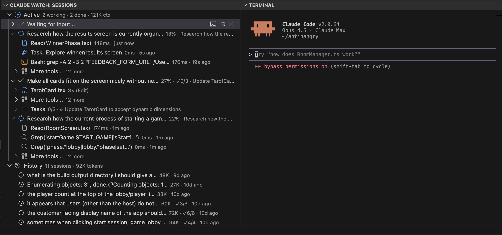

# Claude Watch : Multi Claude Session Manager

**Monitor and manage all your Claude Code sessions from a single VS Code sidebar.**

VS Code terminals are great for running Claude, but you can't tell which session is doing what, whether it's waiting for input, or how close it is to hitting context limits. Claude Watch fixes this by giving you deep visibility into every session: real-time status, context usage, todo progress, and instant recall of any session with a single click.

## Why Claude Watch?

When you're running multiple Claude sessions across terminals, you lose track fast:
- Which terminal is running which prompt?
- Is that session working, or has it been waiting for input for 20 minutes?
- How much context does each session have left?
- What has each session actually accomplished?
- Which parallel subagents or tools is each session currently using?
- How many tokens have I used?

Claude Watch gives you a dashboard tree view of all your sessions with the details that matter, so you can monitor progress and jump to any session instantly.

## Features

- **Session Overview** - All active sessions in one panel with descriptive labels showing what each is working on
- **Real-time Status** - Instantly see which sessions are working, waiting for input, or done
- **Context Window Tracking** - Visual progress bars show token usage and cache hit rates
- **Todo Visibility** - See in-progress tasks and completion counts; expand to view full todo lists
- **Instant Recall** - Click any session to jump straight to its terminal
- **Agent Tracking** - Spawned agents appear nested under their parent sessions
- **Session Pinning** - Pin important sessions to keep them at the top
- **Resume Old Sessions** - Browse and resume past sessions from the sidebar
- **Workspace Filtering** - Only shows sessions for your current VS Code workspace

## Installation

1. Open VS Code
2. Go to Extensions (Ctrl+Shift+X / Cmd+Shift+X)
3. Search for "Claude Watch"
4. Click Install

## Usage

1. Open the Claude Watch panel from the activity bar (chat bubble icon)
2. Start Claude sessions in your terminals—they appear automatically
3. Click a session to jump to its terminal
4. Expand a session to see context usage and todo items

### Session Display

Each session in the tree shows:

| Element | Description |
|---------|-------------|
| **Label** | Session summary, first user message, or custom alias you set |
| **Description** | Current in-progress task with completion count (e.g., "3/5") |
| **Status icon** | Visual indicator of session state (see below) |
| **Context warning** | Icon turns yellow at 75% context, red at 90% |

Hover over any session for a tooltip with full details: status, context stats, current task, working directory, and session ID.

### Status Icons

| Icon | Color | Status |
|------|-------|--------|
| Spinning sync | Blue | Working—Claude is executing tools |
| Pause | Yellow | Paused—waiting for your input |
| Check | Green | Done—task completed |

### Toolbar Buttons

| Button | Action |
|--------|--------|
| Expand All | Expand all sessions to show details |
| Collapse All | Collapse all sessions |
| + | Start a new Claude session |
| Refresh | Refresh the session list |
| ⚙ Settings | Open extension settings |

### Session Actions

**Inline buttons** (visible on hover):

| Button | Action |
|--------|--------|
| Terminal | Jump to the session's terminal |
| Pin | Pin session to the top of the list |
| ✕ Close | Remove from active sessions |

**Right-click menu**:

| Action | Description |
|--------|-------------|
| Copy Resume Command | Copy `claude --resume <id>` to clipboard |
| View Transcript | Open the raw JSONL transcript file |
| Rename Session | Set a custom alias for this session |

### Old Sessions

Past sessions appear in a collapsible "Old Sessions" section:
- Shows how long ago each session was active (e.g., "2h ago")
- Click the ▶ Play button to resume a session
- Right-click to copy resume command or view transcript

### Expandable Details

Click the arrow next to any active session to reveal:
- **Context Info** — Progress bar with token usage, cache hit rate, and output tokens
- **Todo List** — Individual todo items showing pending, in-progress, or completed status

## Requirements

- VS Code 1.85.0 or higher
- macOS or Linux
- [Claude Code CLI](https://docs.anthropic.com/en/docs/claude-code) installed

## Configuration

| Setting | Default | Description |
|---------|---------|-------------|
| `claudeWatch.maxOldSessions` | 100 | Maximum old sessions to display |
| `claudeWatch.claudeCommand` | `claude` | Command to start Claude |
| `claudeWatch.debug` | false | Enable debug logging |

## License

MIT License. See [LICENSE](LICENSE) for details.
